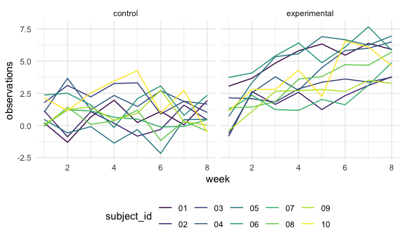
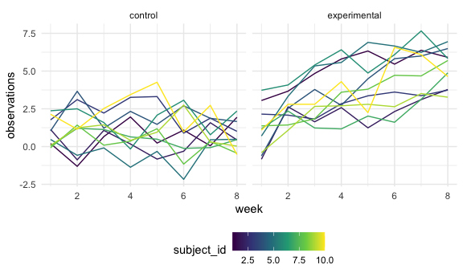
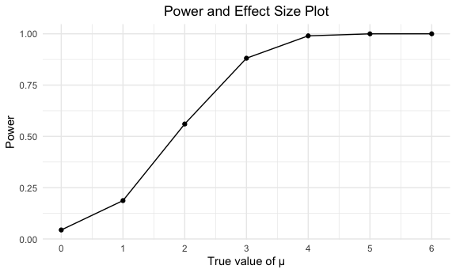
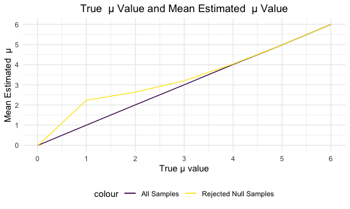

Homework 5
================
Yaa Ababio

## Problem 1

#### Read in and describe the raw data

``` r
homicide_df = 
  read_csv("homicide_data/homicide-data.csv")
```

The Washington Post dataset contains information about 52179 homicides
that occurred in 50 large US cities between the years 2007 and 2017.
This dataset contains 12 variables that describe the date of the
homicide, location of the homicide, characteristics of the victim, and
status of the case related to the homicide. These variables are as
follows: uid, reported\_date, victim\_last, victim\_first, victim\_race,
victim\_age, victim\_sex, city, state, lat, lon, disposition.

#### Create `city_state` variable and `resolved` variable

``` r
homicide_df = 
homicide_df %>% 
  mutate(
    city_state = str_c(city, state, sep = "_"),
    resolved = case_when(
      disposition == "Closed without arrest" ~ "unsolved",
      disposition == "Open/No arrest"        ~ "unsolved",
      disposition == "Closed by arrest"      ~ "solved",
    )
  ) %>% 
  select(city_state, resolved) %>% 
  filter(city_state != "Tulsa_AL")
```

#### Summarize within cities to obtain total number of homicides and unsolved homicides.

``` r
aggregate_df = 
  homicide_df %>% 
  group_by(city_state) %>% 
  summarize(
    hom_total = n(),
    hom_unsolved = sum(resolved == "unsolved")
  )
```

    ## `summarise()` ungrouping output (override with `.groups` argument)

#### Use `prop.test` function to estimate proportion of unsolved homicides, save output as an R object, and pull the estimated proportion and confidence intervals from tidy dataframe using `broom::tidy`.

``` r
prop.test(
  aggregate_df %>% filter(city_state == "Baltimore_MD") %>% pull(hom_unsolved), 
  aggregate_df %>% filter(city_state == "Baltimore_MD") %>% pull(hom_total)) %>% 
  broom::tidy()
```

    ## # A tibble: 1 x 8
    ##   estimate statistic  p.value parameter conf.low conf.high method    alternative
    ##      <dbl>     <dbl>    <dbl>     <int>    <dbl>     <dbl> <chr>     <chr>      
    ## 1    0.646      239. 6.46e-54         1    0.628     0.663 1-sample… two.sided

#### Run `prop.test` for each of the cities, and extract both the proportion of unsolved homicides and the confidence interval for each.

``` r
results_df = 
  aggregate_df %>% 
  mutate(
    prop_tests = map2(.x = hom_unsolved, .y = hom_total, ~prop.test(x = .x, n = .y)),
    tidy_tests = map(.x = prop_tests, ~broom::tidy(.x))
  ) %>% 
  select(-prop_tests) %>% 
  unnest(tidy_tests) %>% 
  select(city_state, estimate, conf.low, conf.high)
```

#### Create a plot that shows the estimates and CIs for reach city.

``` r
results_df %>% 
  mutate(city_state = fct_reorder(city_state, estimate)) %>% 
  ggplot(aes(x = city_state, y = estimate)) +
  geom_point() + 
  geom_errorbar(aes(ymin = conf.low, ymax = conf.high)) + 
  theme(axis.text.x = element_text(angle = 90, vjust = 0.5, hjust = 1))
```


## Problem 2

#### Create a dataframe that contains all file names using the `list.files` and `purrr::map` functions.

``` r
path_df = 
  tibble(
    path = list.files("lda_data"),
  ) %>% 
  mutate(
    path = str_c("lda_data/", path),
    data = map(path, read_csv)) %>%
  unnest(data)
```

#### Tidy the dataframe.

``` r
long_study_df = 
path_df %>%
  separate(path, into = c(NA, "arm_ID"), sep = "/") %>%
  separate(arm_ID, into = c("arm", "ID.csv"), sep = "_") %>%
  separate(ID.csv, into = c("subject_id", NA)) %>%
  mutate(
    arm = recode(arm,
               con = "control",
               exp = "experimental")
    ) %>%
  pivot_longer(
    week_1:week_8,
    names_to = "week",
    names_prefix = "week_",
    values_to = "observations"
  ) %>%
  mutate(
    week = as.numeric(week),
    subject_id = as.numeric(subject_id)
  )
```

#### Make a spaghetti plot showing observations on each subject over time, and comment on differences between groups.

``` r
long_study_df %>%
  group_by(arm, subject_id) %>%
  ggplot(aes(x = week, y = observations, group = subject_id, color = arm)) +
  geom_path() 
```



``` r
long_study_df %>%
ggplot(aes(week, observations, group = subject_id, color = subject_id)) +
  geom_line() +
  facet_grid(~arm) 
```



The spaghetti plot indicates that, on average, study participants in the
experimental group have consistently higher observed values than those
in the control group over the course of the 8 week time span.
Additionally, observed values for individuals in the control arm remain
relatively constant over the 8 week-period, whereas the values for
individuals in the experimental arm appear to gradually increase.

## Problem 3

#### Create function with specified design elements (n = 30, sigma =5, mu = 0) and simulated data from a normal distribution.

``` r
sim_ttest = function(n = 30, mu = 0, sigma = 5) {

sim_data = tibble(
x = rnorm(n, mean = mu, sd = sigma),
)


sim_data %>%
t.test(mu = 0, alternative = 'two.sided', paired = FALSE, conf.level = 0.95) %>%
broom::tidy()

}

output = vector("list", length = 5000)
mu_list = list(
  "mu_0" = 0,
  "mu_1" = 1,
  "mu_2" = 2,
  "mu_3" = 3,
  "mu_4" = 4,
  "mu_5" = 5,
  "mu_6" = 6
 )

for (i in 1:7) {
  output[[i]] =
    rerun(5000, sim_ttest(mu = mu_list[[i]]))
  bind_rows()
}
```

#### Generating 5000 datasets from the model (for each mu value) and storinge estimate and p-value variables in a dataframe.

``` r
results = 
  tibble(
    mu = c(0,1,2,3,4,5,6)
  ) %>%
  mutate(
    output_lists = map(.x = mu, ~rerun(5000, sim_ttest(n = 30, mu = .x))),
    estimate_df = map(output_lists, bind_rows)
  ) %>%
  unnest(estimate_df) %>%
  select(mu, estimate, p.value)
```

#### Power and Effect Size Plot

``` r
power_effect_plot = results %>%
  group_by(mu) %>%
  mutate(
    decision = case_when( p.value < 0.05  ~ "reject",
                          p.value >= 0.05 ~ "fail to reject")
  ) %>%
  count(decision) %>%
  filter(decision == "reject") %>%
  mutate(
    reject_proportion = n/5000
  ) %>%
  
  ggplot(aes(x = mu, y = reject_proportion)) +
  geom_point() +
  geom_line() +
  scale_x_continuous(
    breaks = c(0,1,2,3,4,5,6)
    ) +
  labs(
    title = "Power and Effect Size Plot",
    y = "Power",
    x = "True value of μ"
  ) +
  theme(plot.title = element_text(hjust = 0.5))
  
    
  power_effect_plot
```



Power is the probability of correctly rejecting the null hypothesis. As
effect size increases, power also increases/approaches 1.

#### True mu vs. Average Estimated mu plot

``` r
 avg_estimate = 
  results %>% 
  group_by(mu) %>%
  mutate(
    average = mean(estimate)
  ) 


reject_avg_estimate = 
  results %>%
  group_by(mu) %>%
  mutate(
    decision = case_when( p.value < 0.05  ~ "reject",
                          p.value >= 0.05 ~ "fail to reject")
  ) %>%
  filter(decision == "reject") %>%
  mutate(
    average = mean(estimate)
  )


avg_estimate_plot = 
ggplot(avg_estimate, aes(avg_estimate, x = mu, y = average)) +
  geom_line(aes(color = "All Samples")) +
  geom_line( data = reject_avg_estimate, aes(x = mu, y = average, color = "Rejected Null Samples")) +
 scale_x_continuous(
    breaks = c(0,1,2,3,4,5,6)
    ) +
  scale_y_continuous(
    breaks = c(0,1,2,3,4,5,6)
    ) +
  labs(
    title = "True  μ Value and Mean Estimated  μ Value",
    y = "Mean Estimated  μ",
    x = "True μ value"
  ) +
  theme(plot.title = element_text(hjust = 0.5))
  
avg_estimate_plot
```



In the plot above, we plotted the true value of μ on the x axis and two
versions of the mean estimated μ on the y-axis: (1) the mean estimated μ
across all samples in purple and (2) the mean estimated μ across samples
for which the null was rejected in yellow.

The sample average of mu across tests for which the null is rejected is
approximately equal to the true value of mu at higher effect sizes.
Lower effect sizes are more difficult to estimate as a result of low
power.

In other words, the null hypothesis is rejected more often when effect
size is larger. Thus, for the rejected samples, we observe that
estimated values for smaller effect sizes are less accurate and larger
than the true value of mu.
